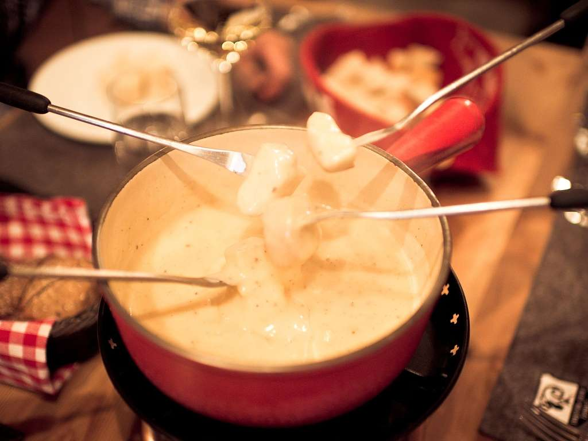

# Day 3 – 2025-06-21 (Sat)

## 行程
- ツェルマット周辺滞在（終日）
- 早朝マッターホルン日の出撮影・パラグライダー体験・村散策

## 宿泊
- ホテル: Appartements Zermatt Paradies（連泊）

## 食事
- 朝: ホテル簡易朝食（事前にベーカリー購入）
- 昼: 山頂パノラマレストラン / ヘリポート近くカフェ
- 夜: Schäferstube（ラム料理）／バックアップ: Pizzeria Ristorante Molino

## 予定（詳細プラン）
- 04:15–05:45 マッターホルン朝焼け撮影（Riffelsee／Stellisee）
  - 03:50 発の早朝列車【Gornergrat Bahn】利用（早朝ダイヤ要確認）
- 06:00–07:30 下山 → ホテル戻り仮眠 & 朝食
- 09:45 FLYBYPARA オフィス集合、装備 & ブリーフィング（Bahnhofplatz 7）
- 10:00–12:00 パラグライダー tandem フライト（Fly Zermatt "Classic" 20–25 分）
- 12:00–13:30 昼食 & 休憩（Furi エリアのカフェまたは村中心部）
- 13:30–16:30 ハイキング: Furi → Zmutt → Zermatt（吊り橋 & アルプス牧歌的風景）
- 16:30–18:00 スパ & サウナ（ホテルまたは Mont Cervin Palace Day Spa）
- 18:30–20:30 ディナー：Schäferstube（ラム料理と地ワイン）
  
  
- 21:00–22:00 ナイトウォーク & 土産ハンティング（Bahnhofstrasse）
- 22:30 就寝

### ＋α オプション
- 天候や混雑状況次第でヘリコプター遊覧（Air Zermatt "Matterhorn Tour" 約 30 分）
- Glacier Paradise 氷の宮殿 & スノーアクティビティ（半日）

### ポイントまとめ
1. 朝焼け撮影は列車ダイヤと天候チェックを前夜に必ず行う。
2. パラグライダーは重量制限 100kg（1 名あたり）・ハイキングシューズ必須。GoPro 写真 & 動画パッケージ CHF 40（1 セット予約済）。
3. 体力温存のため午後は無理せずロープウェイ＋片道ハイキングで調整。

## メモ
- 早朝列車チケットは前日夕方に窓口購入（Swiss Half Fare Card 併用可）。
- パラグライダーの GoPro 写真 & 動画パッケージは追加 CHF 40（着地後スマホ転送）。
- Zmutt の羊チーズは常温 4 時間持ち歩き可、お土産に人気。

### 移動時間の目安
- Zermatt → Riffelalp（早朝列車）: 18 分
- Riffelalp → Riffelsee 徒歩: 15 分（標高差 70m）
- Zermatt → Air Zermatt Heliport 徒歩: 10 分
- Furi → Zmutt ハイキング: 1 時間 30 分 